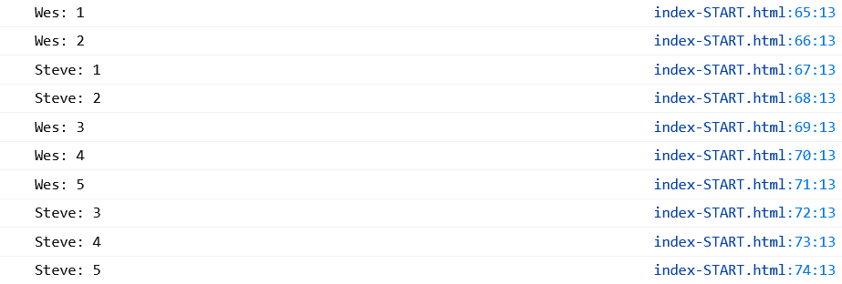

# Day 09 - Dev Tools

Today's exercise was pretty simple, we just worked with a few ```console.``` options, such as <br>
Interpolation and style for ```console.log``` <br>
```console.warn``` <br>
```console.error``` <br>
```console.info``` <br>
```console.assert``` <br>
```console.dir``` <br>
```console.clear``` <br>
```console.group``` <br>
```console.count``` <br>
```console.time``` <br>

```javascript
// Regular
    console.log('JavaScript is great');

    // Interpolated
    console.log('Hello I\'m a %s string!', '💩');
    //console.log(`Hello I'm a ${var} string!`);

    // Styled
    console.log('%c I am a some great text', 'font-size:50px; background:red; text-shadow: 10px 10px 0 blue');

    // warning!
    console.warn('OH NOOO');

    // Error :|
    console.error('Shit!');

    // Info
    console.info('Crocodiles eat 3-4 people per year');

    // Testing
    const p = document.querySelector('p');
    console.assert(1 === 1, 'That is wrong'); //nothing happens
    console.assert(p.classList.contains('ouch'), 'That\'s wrong!');

    // clearing
    console.clear();  //clears the console
 
    // Viewing DOM Elements
    console.log(p); //shows actual element
    console.dir(p); //shows all methods and properties on that element
```

```console.group``` groups categories on the console; ```console.groupCollapsed``` does the same, but the categories will be collapsed (pretty straight forward).

```javascript
    // Grouping together
    
    const dogs = [{ name: 'Snickers', age: 2 }, { name: 'hugo', age: 8 }];
    
    dogs.forEach(dog => {
      console.groupCollapsed(`${dog.name}`);
      console.log(`This is ${dog.name}`);
      console.log(`${dog.name} is ${dog.age}`);
      console.log(`${dog.name} is ${dog.age * 7} dog years old`);
      console.groupEnd(`${dog.name}`);
    });
```

```console.count``` counts the instances of the same item:
    
```javascript
    // counting
    console.count('Wes');
    console.count('Wes');
    console.count('Steve');
    console.count('Steve');
    console.count('Wes');
    console.count('Wes');
    console.count('Wes');
    console.count('Steve');
    console.count('Steve');
    console.count('Steve');
```




```javascript
    // timing
    console.time('fetching data');
    fetch('https://api.github.com/users/hnbreyer')
      .then(data => data.json())
      .then(data => {
        console.timeEnd('fetching data');
        console.log(data);  
      });
```

